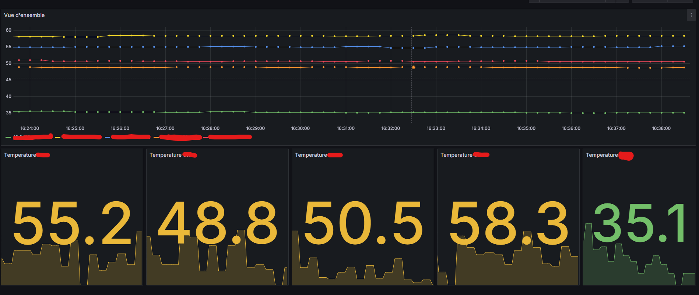

# Temperature Exporter pour Prometheus (hwmon)

Un petit exporter Prometheus, simple et robuste, qui expose les températures du système Linux à partir de /sys/class/hwmon. Conçu pour tourner sur Proxmox, Debian, Ubuntu et autres distributions, avec une surface d’attaque minimale.

- Binaire unique en Go, sans dépendances système
- Labels: chip, sensor, label
- Endpoints: /metrics, /healthz
- Packaging: Dockerfile distroless, unité systemd, Makefile
- Sources: /sys/class/hwmon, /sys/class/thermal, et optionnellement `sensors -j` (lm-sensors)

## Fonctionnement

Le service parcourt le répertoire /sys/class/hwmon, détecte les fichiers temp*_input (valeurs en millidegré Celsius) et expose des métriques en degrés Celsius via HTTP. Quand disponible, les fichiers temp*_label ou temp*_type sont utilisés comme libellés compréhensibles (Tctl, CPU, etc.).

Métriques principales:

- temp_exporter_temperature_celsius{chip="…", sensor="…", label="…"}
- temp_exporter_scrape_duration_seconds

## Installation

Choisissez l’une des deux méthodes ci-dessous.

### Option A — Binaire depuis GitHub Releases (recommandé)

1) Aller sur la page des releases et télécharger le binaire adapté à votre architecture:

	- https://github.com/Tutanka01/Temperature-Exporter-Proxmox/releases
	- Fichiers disponibles: `temperature-exporter-linux-amd64`, `temperature-exporter-linux-arm64` et `SHA256SUMS`.

2) Vérifier l’intégrité (fortement conseillé):

```bash
sha256sum -c SHA256SUMS 2>/dev/null | grep temperature-exporter-linux-$( [ "$(uname -m)" = "x86_64" ] && echo amd64 || echo arm64 )
```

3) Installer le binaire

```bash
sudo install -m 0755 temperature-exporter-linux-$( [ "$(uname -m)" = "x86_64" ] && echo amd64 || echo arm64 ) /usr/local/bin/temperature-exporter
```

4) Lancer pour tester

```bash
/usr/local/bin/temperature-exporter -listen=":9102"
```

### Option B — Build depuis les sources

Prérequis: Go 1.22+.

```bash
make build
./bin/temperature-exporter -listen=":9102"
```

Test rapide (quelle que soit l’option):

```bash
curl -sf http://127.0.0.1:9102/healthz
curl -sf http://127.0.0.1:9102/metrics | head
```

## Déploiement systemd (hôte Proxmox/Linux)

Installation rapide (par défaut écoute sur 0.0.0.0:9102):

```bash
# 1) Installer le binaire
# - Depuis Releases:
#   sudo install -m 0755 temperature-exporter-linux-amd64 /usr/local/bin/temperature-exporter
#   # ou ARM64: sudo install -m 0755 temperature-exporter-linux-arm64 /usr/local/bin/temperature-exporter
# - Depuis sources:
#   sudo install -m 0755 bin/temperature-exporter /usr/local/bin/temperature-exporter

# 2) Installer le service systemd
sudo install -m 0644 packaging/temperature-exporter.service /etc/systemd/system/temperature-exporter.service

# 3) (Optionnel) Configurer l'adresse d'écoute via /etc/default/temperature-exporter
sudo install -m 0644 packaging/temperature-exporter.env.example /etc/default/temperature-exporter
# Éditez et modifiez LISTEN_ADDR (par défaut: 0.0.0.0:9102)

# 4) Activer et démarrer
sudo systemctl daemon-reload
sudo systemctl enable --now temperature-exporter

# 5) Vérifier
systemctl status temperature-exporter
curl -sf http://127.0.0.1:9102/metrics | head
```

Note sécurité: l’unité est durcie (NoNewPrivileges, ProtectSystem, etc.) et octroie CAP_DAC_READ_SEARCH uniquement pour lire /sys. Si votre /sys est monté différemment, adaptez ReadOnlyPaths.

## Déploiement via Docker

Construire l’image:

```bash
docker build -t temp-exporter:latest .
```

Lancer (lecture de /sys en read-only):

```bash
docker run --rm -p 9102:9102 \
	--read-only \
	-v /sys/class/hwmon:/sys/class/hwmon:ro \
	--cap-drop ALL \
	temp-exporter:latest -listen=":9102" -hwmon="/sys/class/hwmon"
```

Astuce Podman/Rootless: montez /sys/class/hwmon en lecture seule et conservez cap-drop ALL (le binaire n’a pas besoin de capacités root en conteneur).

## Configuration Prometheus

Ajoutez un job de scrape dans prometheus.yml:

```yaml
scrape_configs:
	- job_name: 'temperature_exporter'
		static_configs:
			- targets: ['HOST_IP:9102']
```

Métriques exposées sur /metrics.

## Options CLI

- -listen string: adresse d’écoute (par défaut ":9102")
- -path string: chemin HTTP des métriques (par défaut "/metrics")
- -hwmon string: base des capteurs (par défaut "/sys/class/hwmon")
- -thermal string: base des thermal zones (par défaut "/sys/class/thermal")
- -enable-hwmon bool: activer hwmon (par défaut true)
- -enable-thermal bool: activer thermal zones (par défaut true)
- -enable-sensors-cli bool: activer `sensors -j` (lm-sensors requis) (par défaut false)
- -enable-sensors-cli bool: activer `sensors -j` (lm-sensors requis) (par défaut true)
- -sensors-cli-path string: chemin de la commande sensors (par défaut "sensors")
- -sensors-timeout duration: timeout exécution sensors -j (par défaut 2s)
- -namespace string: préfixe des métriques (par défaut "temp_exporter")
- timeouts HTTP réglables: -read-timeout, -write-timeout, -read-header-timeout, -idle-timeout
- -log-requests: logs d’accès HTTP (optionnel)

## Sécurité et robustesse

- Binaire non-root recommandé; en systemd, capacité minimale CAP_DAC_READ_SEARCH pour lire /sys
- Pas d’entrée utilisateur; lecture en lecture seule de fichiers système
- Tolérance aux erreurs: capteurs manquants/illisibles ignorés proprement
- Serveur HTTP avec timeouts et arrêt gracieux sur SIGTERM

## Dépannage

- Aucune métrique temp_exporter_temperature_celsius n’apparaît:
	- Vérifiez la présence de /sys/class/hwmon
	- Vérifiez les permissions: sur un hôte strict, donnez CAP_DAC_READ_SEARCH au service
	- Certains environnements virtuels n’exposent pas les capteurs; installez lm-sensors et chargez les modules nécessaires
	- Essayez également les thermal zones (activées par défaut): `-enable-thermal=true`
	- Optionnel: activez `sensors -j` si disponible: `-enable-sensors-cli` (paquet lm-sensors requis)
	- Exemple d’installation des paquets:
		- Debian/Ubuntu/Proxmox: `apt-get update && apt-get install -y lm-sensors`
		- RHEL/CentOS/Rocky: `yum install -y lm_sensors`
		- Alpine: `apk add lm-sensors`

## Exemple de sortie des métriques (via lm-sensors)

Exemple réel (extrait) lorsque lm-sensors est installé et `-enable-sensors-cli` actif:

```text
# HELP temp_exporter_scrape_duration_seconds Durée de la dernière collecte des températures.
# TYPE temp_exporter_scrape_duration_seconds gauge
temp_exporter_scrape_duration_seconds 0.018435873
# HELP temp_exporter_temperature_celsius Température en degrés Celsius lue depuis les capteurs système (hwmon, thermal, lm-sensors).
# TYPE temp_exporter_temperature_celsius gauge
temp_exporter_temperature_celsius{chip="bnxt_en-pci-3b00",label="",sensor="temp1"} 62
temp_exporter_temperature_celsius{chip="bnxt_en-pci-3b01",label="",sensor="temp1"} 62
temp_exporter_temperature_celsius{chip="coretemp-isa-0000",label="",sensor="Core 0"} 39
temp_exporter_temperature_celsius{chip="coretemp-isa-0000",label="",sensor="Core 1"} 38
...
temp_exporter_temperature_celsius{chip="i350bb-pci-1903",label="",sensor="loc1"} 62
temp_exporter_temperature_celsius{chip="pch_lewisburg-virtual-0",label="",sensor="temp1"} 49
```

Explication des labels:
- chip: l’identifiant du “chip” ou source détectée (ex: coretemp-isa-0000, bnxt_en-pci-3b00). Cela vient de hwmon/lm-sensors.
- sensor: le nom humainement lisible du capteur (ex: Core 0, Package id 0, temp1). Il provient d’un label/section associé au capteur.
- label: libellé additionnel si fourni par le driver (souvent vide); selon les systèmes, cela peut contenir un rôle spécifique (Tctl, Tdie, etc.).

Conseil: sélectionnez les séries qui vous intéressent avec PromQL (ex: filtrer uniquement les cores CPU) et ajoutez des alertes selon vos seuils.

- Erreurs de build:
	- Vérifiez votre Go >= 1.22; sinon, utilisez le Dockerfile fourni

- Impossible d’accéder en HTTP depuis un autre poste:
	- Vérifiez que vous utilisez les bons endpoints: `/metrics` et `/healthz` (le chemin `/` affiche juste des infos).
	- Lancez en écoutant sur toutes interfaces: `-listen="0.0.0.0:9102"` (évitez `127.0.0.1` si accès distant).
	- Testez en local sur le serveur: `curl -sf http://127.0.0.1:9102/healthz`.
	- Depuis le poste distant, utilisez `curl -v http://IP:9102/healthz` pour voir s’il y a un refus/timeout.
	- Activez les logs de requêtes pour diagnostiquer: lancez avec `-log-requests` et vérifiez les entrées `GET /metrics -> 200 (...)`.
	- Ouvrez le port 9102/tcp sur le pare-feu si nécessaire (ou vérifiez les ACLs/VRF/routage).

## Grafana integration

Dans le dossier grafana-template, vous trouverez un exemple de template JSON deja prete a importer dans Grafana.



## Licence

AGPL. Voir le fichier LICENSE pour plus de détails.
